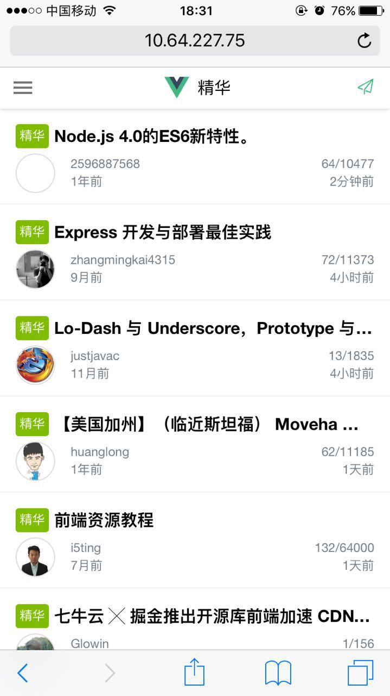
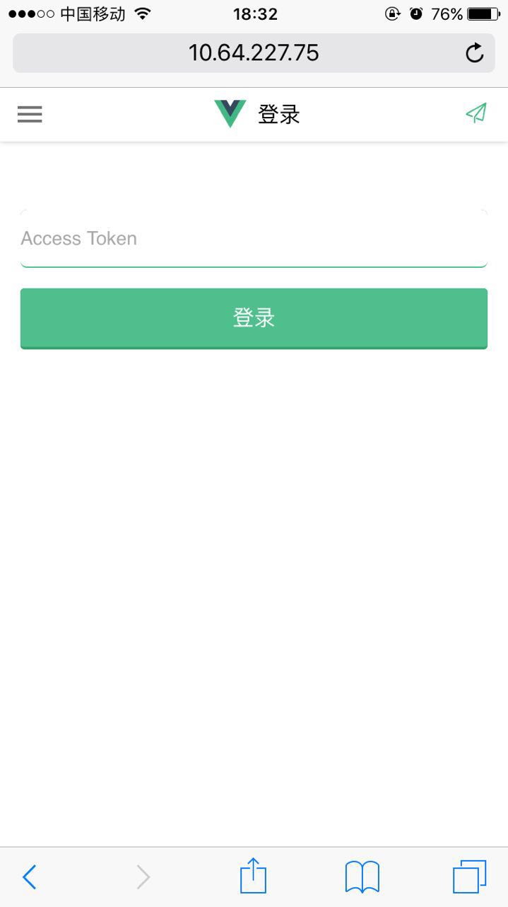
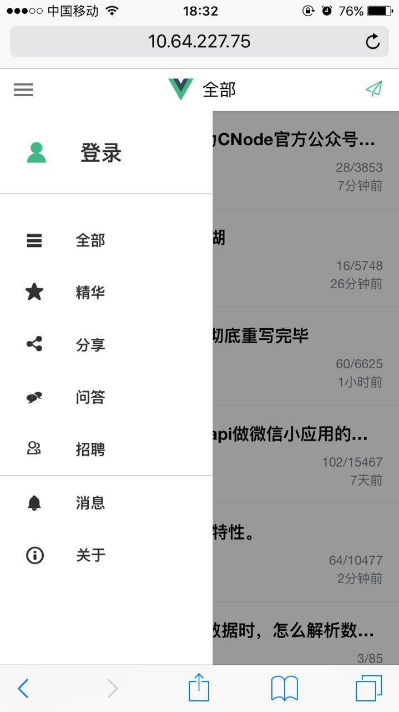
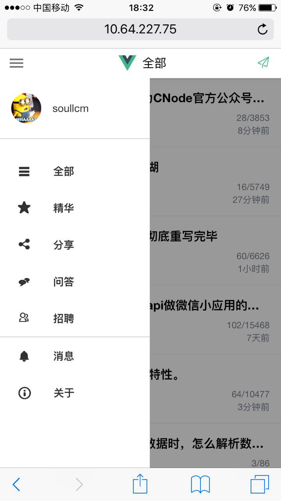
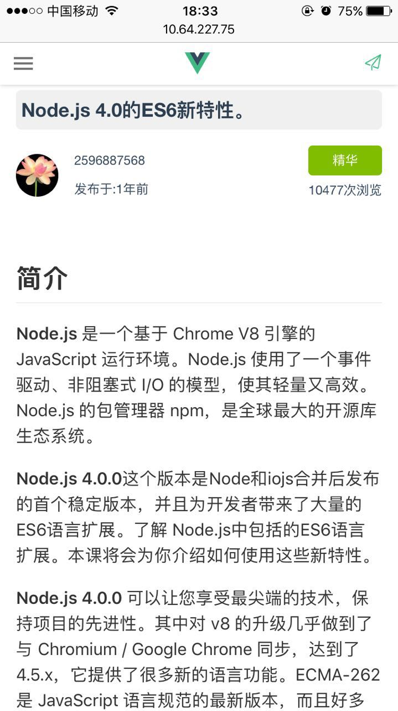
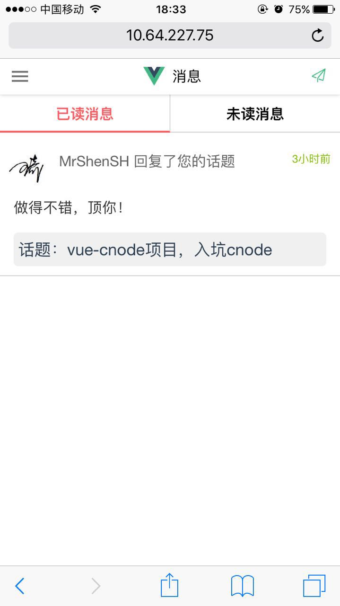

# vue-cnode-mobile

线上地址: [vue-cnode-mobile](https://soulcm.github.io/vue-cnode-mobile/)，当然能不能打开，真的是看脸的

重构vue-cnode-mobile，doing中，按以下知识点进行

知识点：
* vue2
* vuex2
* vue-router2
* webpack2
* 服务端渲染
* 移动端开发
* fetch
* es6 es7
* less 不用sass的理由你懂的，那个难安装

优化项：
1. 优化css结构
2. 优化router结构
3. 优化vuex结构
4. 加入transition效果
5. 优化webpack打包
5. 引入服务端渲染？
6. ...

对跟路径/和/list路径支持服务端渲染，其他路径仍然走客户端渲染

运行步骤

```
//development
npm i -g nodemon

npm install

npm run build:dll-dev

npm run dev
```

访问 http://127.0.0.1:8888

```
//production
npm run build

npm run prod
```
访问 http://127.0.0.1:8888

服务启动后，手机端可访问本机ip查看


吐槽: vscode编辑器对vue的支持好差














